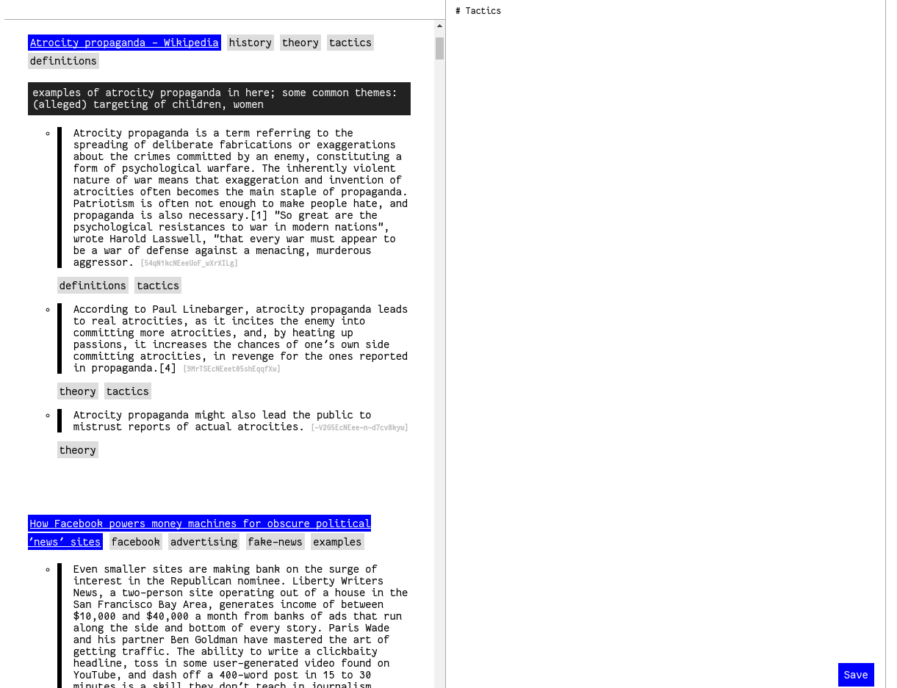

little tool for browsing [hypothes.is](https://hypothes.is) annotations for a group.

to use:

- create `config.py` and set `GROUP` to the group name and `API_TOKEN` to your hypothe.is API token. Set `SCREENSHOT` to `False` or `True` depending on if you want screenshots of each annotated site.
- run `hypothesis.py` to download the group annotations to `annos.json`
- run `app.py` to run the server, then visit `localhost:5000`

the tool provides the following functionality:

- lists all the group's annotations, organized by page
- click on tag(s) to filter
- text input to take notes (saves to `notes.md`)
- each highlight has its id after it; click on it to copy it. you can use this to keep track of references

